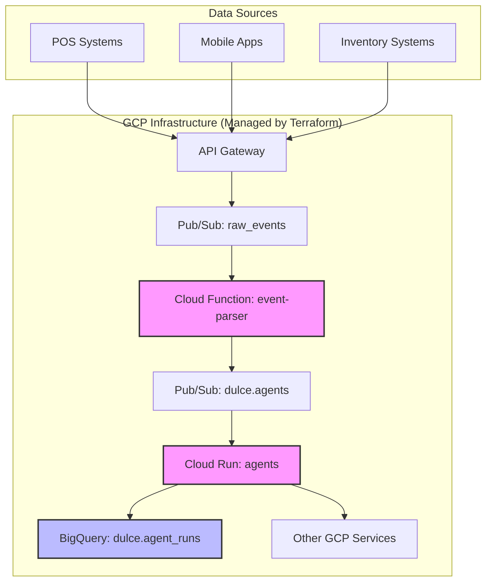

# Dulce de Saigon F&B Data Platform (`saigon-signals`)

Welcome to the `saigon-signals` repository, the core of the **Dulce de Saigon F&B Data Platform**. This project is a comprehensive, cloud-native data platform designed to capture, process, and analyze food and beverage data, specifically tailored for the Vietnamese market context.

This monorepo, managed with [Nx](https://nx.dev/), contains all the necessary applications, libraries, and infrastructure configurations to run the platform on Google Cloud Platform (GCP).

## Architecture Overview

The platform is built on an event-driven, serverless architecture to ensure scalability, reliability, and cost-effectiveness.



### Key Components:

-   **`event-parser` (Cloud Function)**: A serverless function that triggers on new messages in a Pub/Sub topic. It validates, standardizes, and enriches raw incoming data before publishing it to the `dulce.agents` topic for further processing.
-   **`agents` (Cloud Run Service)**: A containerized application that consumes messages from the `dulce.agents` topic. It runs various data processing agents (e.g., for analytics, machine learning, or operational tasks) and logs the results of each run to the `dulce.agent_runs` table in BigQuery.
-   **`dulce.agents` (Pub/Sub Topic)**: A central message bus for distributing standardized events to the `agents` service.
-   **`dulce.agent_runs` (BigQuery Table)**: A data warehouse table that serves as an immutable log of all agent activities, providing a clear audit trail and data source for analytics.
-   **Infrastructure as Code (Terraform)**: All GCP resources (Pub/Sub topics, BigQuery tables, Cloud Run services, Cloud Functions, IAM policies, etc.) are defined and managed using [Terraform](https://www.terraform.io/) in the [`infra/terraform`](./infra/terraform) directory.
-   **Nx Monorepo**: The entire project is structured as a monorepo using [Nx](https://nx.dev), which helps manage shared dependencies, streamline build processes, and maintain a consistent development environment.

## Setup and Installation

### Prerequisites

Before you begin, ensure you have the following installed:
*   [Node.js](https://nodejs.org/) (v18 or higher, as defined in `.nvmrc`)
*   [pnpm](https://pnpm.io/installation)
*   [Google Cloud SDK](https://cloud.google.com/sdk/docs/install)

### Installation Steps

1.  **Clone the repository:**
    ```bash
    git clone https://github.com/your-org/saigon-signals.git
    cd saigon-signals
    ```

2.  **Install dependencies:**
    This project uses `pnpm` for package management.
    ```bash
    pnpm install
    ```

## Environment Variables

Create a `.env` file in the root of the repository and add the following variables. These are essential for connecting to GCP services during local development and testing.

```env
# .env

# Google Cloud Platform Configuration
GCP_PROJECT_ID="saigon-signals"
GCP_REGION="asia-southeast1" # Or your preferred region

# Name of the GCS bucket for Terraform state
TF_STATE_BUCKET="saigon-signals-tf-state"

# Add any other secrets or environment-specific variables here
# Example:
# DATABASE_URL="your-database-connection-string"
```

-   `GCP_PROJECT_ID`: Your Google Cloud project ID.
-   `GCP_REGION`: The GCP region where resources will be deployed.
-   `TF_STATE_BUCKET`: The GCS bucket used for storing the Terraform remote state.

## Running Locally

You can run the different applications within the monorepo using Nx commands.

-   **Run the `agents` service:**
    ```bash
    npx nx serve agents
    ```
-   **Run the `api` service:**
    ```bash
    npx nx serve api
    ```

## Running Tests

### Unit Tests
To run unit tests for a specific application or library:
```bash
# Test the 'agents' application
npx nx test agents

# Test the 'gcp' library
npx nx test gcp
```

### End-to-End (E2E) Tests
The E2E test suite validates the entire data processing workflow, from publishing a message to a Pub/Sub topic to verifying the data in BigQuery.

To run the E2E tests, execute the following script:
```bash
python tests/e2e_workflow.py
```
*Note: Ensure your local environment is authenticated with GCP (`gcloud auth application-default login`) before running the E2E tests.*

## Deployment (CI/CD)

Deployment is automated using **Google Cloud Build** and is defined in the [`cloudbuild.yaml`](./cloudbuild.yaml) file at the root of the repository.

### CI/CD Process:

1.  **Trigger**: The Cloud Build pipeline is automatically triggered on every push to the `main` branch.
2.  **Build**: Docker images for the `agents` and other services are built and pushed to the Google Artifact Registry.
3.  **Test**: Unit tests are executed to ensure code quality and correctness.
4.  **Deploy**:
    *   The `event-parser` Cloud Function is deployed.
    *   The `agents` service is deployed to Cloud Run.
    *   Terraform is used to apply any infrastructure changes.

This automated process ensures that every change pushed to the main branch is built, tested, and deployed consistently and reliably.

## Compliance and Vietnamese Market Context

This platform is architected with a strong focus on compliance and cultural relevance for the Vietnamese market.

-   **Data Compliance**: Adheres to Vietnam's Personal Data Protection Law (PDPL), including data localization requirements. All data is processed and stored in the `asia-southeast1` GCP region.
-   **Market Fit**: Data models and processing logic are designed to accommodate the unique characteristics of the Vietnamese F&B industry, from currency (VND) and payment methods to local dining habits.