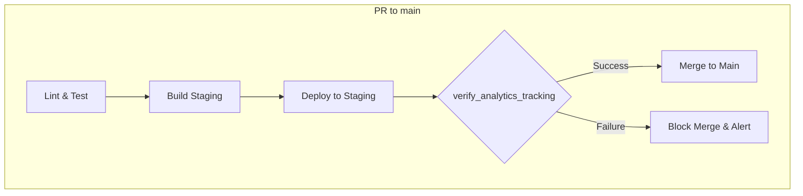

# GA4 Implementation Plan: Phase 2
## Core GA4 Implementation & BigQuery Integration for the Agent Developer Kit (ADK)

**Project:** `saigon-signals`
**Owner:** ADK Core Team

This document outlines the tasks, commands, and validation steps for Phase 2 of the Google Analytics 4 (GA4) implementation. This phase focuses on establishing a robust, foundational event taxonomy, implementing tracking across all data streams, linking GA4 to BigQuery, and building automated CI/CD checks to ensure data integrity.

This plan assumes that separate GA4 properties for Dev, Staging, and Production environments have been created as part of Phase 1.

---

### 1. Basic Tagging & Event Tracking

This section defines the core event taxonomy and provides implementation guidance. The official source of truth for this taxonomy is the [`event-taxonomy.yaml`](./event-taxonomy.yaml) file.

#### 1.1. Foundational Event Taxonomy

The following events form the baseline for tracking user interactions. All events should include a persistent, non-PII `user_id` where available.

| Event Name | Description | Recommended Parameters |
| :--- | :--- | :--- |
| `page_view` | Fires when a user views a page. | `page_location`, `page_title`, `page_path` |
| `login` | Fires on successful user login. | `method` (e.g., 'google', 'email'), `user_id` |
| `sign_up` | Fires on successful account creation. | `method` (e.g., 'google', 'email'), `user_id` |
| `purchase`| Fires upon completion of a sale. | `transaction_id`, `value`, `currency`, `items`, `tax`, `shipping` |
| `form_submission` | Fires when a user submits a form. | `form_id`, `form_name`, `form_destination` |

#### 1.2. Implementation Guidance

##### **Web (`gtag.js` / GTM)**

For the web, wrap `gtag` calls in a dedicated tracking utility to ensure consistency.

```javascript
// Example: /apps/web/site/components/Track.tsx

/**
 * Sends an event to Google Analytics.
 * @param {string} eventName The name of the event.
 * @param {object} eventParams The event parameters.
 */
export const trackEvent = (eventName, eventParams) => {
  if (window.gtag) {
    window.gtag('event', eventName, eventParams);
  } else {
    console.warn('gtag.js not found. Tracking event skipped.');
  }
};

// --- Usage Example: ---
// trackEvent('login', { method: 'email', user_id: '123' });
// trackEvent('form_submission', { form_id: 'contact-us', form_name: 'Contact Form' });
```

##### **iOS (Firebase SDK)**

Use the Firebase SDK to log events. Create a centralized `AnalyticsManager` class.

```swift
// Example: AnalyticsManager.swift

import FirebaseAnalytics

class AnalyticsManager {
    static let shared = AnalyticsManager()

    private init() {}

    func logEvent(name: String, parameters: [String: Any]?) {
        Analytics.logEvent(name, parameters: parameters)
    }
}

// --- Usage Example: ---
// AnalyticsManager.shared.logEvent(name: "sign_up", parameters: ["method": "google", "user_id": "456"])
```

##### **Android (Firebase SDK)**

Similarly, use the Firebase SDK on Android with a centralized manager.

```kotlin
// Example: AnalyticsManager.kt

import com.google.firebase.analytics.FirebaseAnalytics
import com.google.firebase.analytics.ktx.analytics
import com.google.firebase.analytics.ktx.logEvent
import com.google.firebase.ktx.Firebase

class AnalyticsManager(context: Context) {
    private val firebaseAnalytics: FirebaseAnalytics = Firebase.analytics

    fun logEvent(name: String, params: Bundle) {
        firebaseAnalytics.logEvent(name, params)
    }
}

// --- Usage Example: ---
// val analyticsManager = AnalyticsManager(this)
// val bundle = Bundle().apply {
//     putString("method", "github")
//     putString("user_id", "789")
// }
// analyticsManager.logEvent("login", bundle)
```

---

### 2. BigQuery Linking & Schema Verification

This section details the process of enabling the native GA4 data export to BigQuery and provides a script to verify the setup.

#### 2.1. Linking GA4 to BigQuery

Execute the following `gcloud` command for each GA4 property (Dev, Staging, Prod). Replace `<GA4_PROPERTY_ID>` with the actual ID for each environment.

```bash
# Set the project context
gcloud config set project saigon-signals

# Command to link GA4 to BigQuery
# NOTE: The user running this command must have Owner role on the GCP project
# and Admin role on the GA4 Property.
gcloud alpha analytics admin links create \
  --property=<GA4_PROPERTY_ID> \
  --organization=YOUR_ORGANIZATION_ID \ # Or --account=YOUR_GA_ACCOUNT_ID
  --link-provider=firebase \ # Use 'google-analytics' if not a Firebase project
  --type=bigquery-link \
  --region=YOUR_BIGQUERY_REGION # e.g., us-central1
```
*Note: As of now, linking via CLI can be complex. The **recommended and most reliable method** is using the Google Analytics UI under `Admin > Property > Product Links > BigQuery Linking`.*

#### 2.2. Reusable Verification Script

This script verifies that the BigQuery dataset and tables have been created successfully. It should be run in a CI pipeline 24-48 hours after linking to allow for the first daily export.

```bash
#!/bin/bash
# Filename: /adk/services/analytics/scripts/verify_bigquery_link.sh

set -e

# Parameters
GA4_PROPERTY_ID="$1"
PROJECT_ID="saigon-signals"
DATASET_NAME="analytics_${GA4_PROPERTY_ID}"
MAX_DAYS_TO_CHECK=3 # Check for tables from the last 3 days

if [ -z "$GA4_PROPERTY_ID" ]; then
  echo "Usage: $0 <GA4_PROPERTY_ID>"
  exit 1
fi

echo "Verifying BigQuery link for GA4 Property: ${GA4_PROPERTY_ID}"
echo "Target Dataset: ${DATASET_NAME}"

# 1. Verify Dataset Existence
if ! bq --project_id "$PROJECT_ID" show "$DATASET_NAME" &> /dev/null; then
  echo "❌ Verification Failed: Dataset '${DATASET_NAME}' does not exist."
  exit 1
else
  echo "✅ Dataset '${DATASET_NAME}' found."
fi

# 2. Verify Presence of 'events_' Sharded Tables
echo "Checking for 'events_' tables..."
for i in $(seq 0 $MAX_DAYS_TO_CHECK); do
  DATE_SUFFIX=$(date --date="$i days ago" +%Y%m%d)
  TABLE_NAME="events_${DATE_SUFFIX}"
  if bq --project_id "$PROJECT_ID" show "${DATASET_NAME}.${TABLE_NAME}" &> /dev/null; then
    echo "✅ Verification Succeeded: Found events table '${TABLE_NAME}'."
    exit 0
  fi
done

echo "❌ Verification Failed: No 'events_*' tables found in the last ${MAX_DAYS_TO_CHECK} days."
exit 1
```

---

### 3. CI/CD Stage Gate

This section describes an automated check to validate tracking code before it is merged to the main branch.

#### 3.1. Pipeline Design

A new stage, `verify_analytics_tracking`, will be added to the CI/CD pipeline for Pull Requests targeting `main`.



#### 3.2. Automated Verification Check

The `verify_analytics_tracking` stage will use a script to query BigQuery's real-time (intraday) export table. This provides near-instant feedback.

**Prerequisites:**
1.  The `verify_analytics_tracking` job must be authenticated with a GCP service account that has the `BigQuery User` role.
2.  The Staging environment must be configured to send a specific, identifiable test event on startup or after a key action.

**Verification Script Logic:**

This script will query the `events_intraday_` table, looking for a specific test event triggered by the CI/CD pipeline itself in the staging environment.

```bash
#!/bin/bash
# Filename: /adk/services/analytics/scripts/check_staging_events.sh

set -e

# Parameters
GA4_PROPERTY_ID_STAGING="$1"
TEST_EVENT_NAME="ci_stage_gate_check"
PROJECT_ID="saigon-signals"
DATASET_NAME="analytics_${GA4_PROPERTY_ID_STAGING}"
TABLE_NAME="events_intraday_"
CI_RUN_ID="$2" # Unique ID for this CI run
MAX_WAIT_SECONDS=300 # 5 minutes
SLEEP_INTERVAL=20 # 20 seconds

if [ -z "$GA4_PROPERTY_ID_STAGING" ] || [ -z "$CI_RUN_ID" ]; then
  echo "Usage: $0 <GA4_PROPERTY_ID_STAGING> <CI_RUN_ID>"
  exit 1
fi

# Here, you would trigger the action in your staging app that sends the event
# For example, via a curl command to a test endpoint:
# curl -X POST https://staging.your-app.com/api/trigger-test-event -d "{\"ci_run_id\": \"$CI_RUN_ID\"}"

echo "Checking for '${TEST_EVENT_NAME}' event in BigQuery for CI run: ${CI_RUN_ID}..."

ELAPSED_TIME=0
while [ $ELAPSED_TIME -lt $MAX_WAIT_SECONDS ]; do
  QUERY="
    SELECT COUNT(*)
    FROM \`${PROJECT_ID}.${DATASET_NAME}.${TABLE_NAME}\`
    WHERE event_name = '${TEST_EVENT_NAME}'
    AND EXISTS (
        SELECT 1
        FROM UNNEST(event_params) AS params
        WHERE params.key = 'ci_run_id' AND params.value.string_value = '${CI_RUN_ID}'
    )
  "
  
  COUNT=$(bq --project_id "$PROJECT_ID" --format=json query --nouse_legacy_sql "$QUERY" | jq -r '.[0].f0_')

  if [ "$COUNT" -gt 0 ]; then
    echo "✅ Gate Passed: Found ${COUNT} event(s) for CI run ${CI_RUN_ID}."
    exit 0
  fi

  echo "Event not found... waiting ${SLEEP_INTERVAL}s. (Elapsed: ${ELAPSED_TIME}s)"
  sleep $SLEEP_INTERVAL
  ELAPSED_TIME=$((ELAPSED_TIME + SLEEP_INTERVAL))
done

echo "❌ Gate Failed: Timed out after ${MAX_WAIT_SECONDS}s. No '${TEST_EVENT_NAME}' event was received in BigQuery for CI run ${CI_RUN_ID}."
exit 1

```
This script acts as a powerful gate, ensuring that tracking changes are functioning correctly in a live-like environment before they are approved for production.