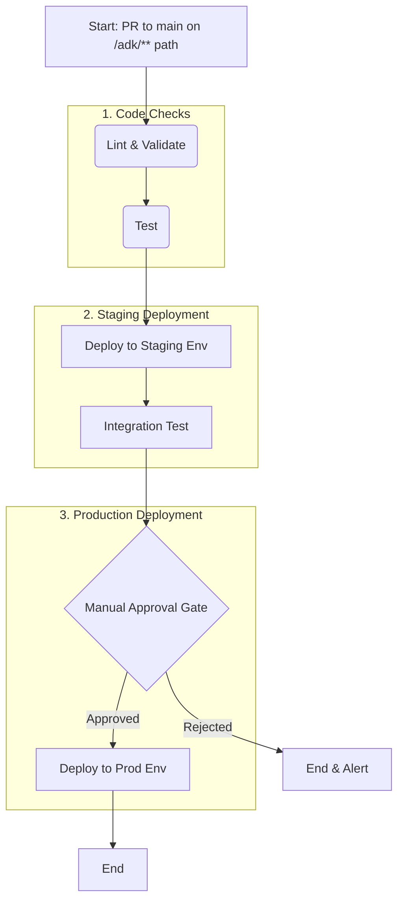

# GA4 Implementation Plan: Phase 4 - Automation, Operations & Expansion

**Project:** `saigon-signals`

This document details the final phase of the GA4 implementation, focusing on transforming the collected data into operational, business-ready assets through robust automation and a forward-looking roadmap. This phase builds directly on the foundations laid in Phases 2 and 3, unifying data collection and configuration-as-code into a mature, end-to-end analytics system.

---

## 1. BigQuery Data Transformation

With raw GA4 event data flowing into BigQuery, the next critical step is to transform this complex, nested JSON data into clean, aggregated, and business-friendly tables. These new tables will serve as the trusted source for all downstream analytics, from reporting to BI dashboards and ML models.

### 1.1. Tool Recommendation: dbt Core

For transforming data within BigQuery, we recommend **dbt (Data Build Tool) Core**.

**Justification:**

*   **Industry Standard & Community:** dbt is the de-facto standard for transformation-in-warehouse. It has a massive, active community, which translates to excellent documentation, a wealth of pre-built packages (including one specifically for GA4), and strong support.
*   **SQL-First:** dbt allows analysts to do complex data engineering using only SQL, democratizing data transformation. This aligns perfectly with the goal of an Analytics Development Kit (ADK).
*   **Integrated Testing & Documentation:** dbt has built-in features for data quality testing (e.g., uniqueness, not null) and automatically generates documentation for your data models. This is crucial for maintaining a reliable data source.
*   **Version Control Native:** dbt projects are designed to live in a Git repository, making them a natural fit for our existing monorepo and CI/CD-driven approach. While Dataform offers similar functionality and tighter GCP integration, dbt's broader community and feature maturity provide a more robust, long-term solution.

### 1.2. dbt Core Setup in the ADK Monorepo

The dbt project will be structured within the `/adk` directory to keep it aligned with other analytics configurations.

**Directory Structure:**

```
adk/
└── services/
    └── analytics/
        ├── dbt/
        │   ├── models/
        │   │   ├── staging/             -- Lightly cleaned, 1:1 with source
        │   │   │   └── ga4/
        │   │   │       ├── stg_ga4__events.sql
        │   │   │       └── stg_ga4__event_params.sql
        │   │   ├── intermediate/        -- Intermediate transformations
        │   │   └── marts/               -- Final, business-facing models
        │   │       ├── fact_sessions.sql
        │   │       └── dim_users.sql
        │   ├── macros/
        │   ├── tests/
        │   ├── dbt_project.yml        -- Main dbt project configuration
        │   └── profiles.yml           -- Connection details (use .gitignore)
        └── ...
```

**Setup Steps:**

1.  **Initialize dbt Project:** A new dbt project will be created in `adk/services/analytics/dbt/`.
2.  **Configure `profiles.yml`:** The connection profile for BigQuery will be configured to use a dedicated service account with `BigQuery Data Editor` and `BigQuery Job User` roles for the `saigon-signals` project. This file should be git-ignored and managed via secrets.
3.  **Install dbt-utils and ga4 Packages:** We will add community packages to `packages.yml` to accelerate development:
    ```yaml
    # adk/services/analytics/dbt/packages.yml
    packages:
      - package: dbt-labs/dbt_utils
        version: [">=1.0.0", "<2.0.0"]
      - package: "https://github.com/dbt-labs/dbt-ga4.git" # Use the official GA4 package
        revision: main # Pin to a specific commit/release in production
    ```

### 1.3. Sample Transformation Model

This example demonstrates how to transform raw `events_*` data into `dim_users` and `fact_sessions` models. It uses a simplified approach; the actual implementation would leverage the pre-built `dbt-ga4` package macros for robustness.

**`adk/services/analytics/dbt/models/marts/fact_sessions.sql`:**

```sql
-- This model creates a session-level fact table, providing one row per session.
-- It unnests key parameters and aggregates session metrics.

WITH session_events AS (
    SELECT
        -- Session identifier
        CONCAT(user_pseudo_id, '-', (SELECT value.int_value FROM UNNEST(event_params) WHERE key = 'ga_session_id')) AS session_id,
        user_pseudo_id AS user_id,
        MIN(event_timestamp) AS session_start_timestamp,
        MAX(event_timestamp) AS session_end_timestamp,
        
        -- Unnest and find the first page location and referrer for the session
        MAX(CASE WHEN event_name = 'session_start' THEN (SELECT value.string_value FROM UNNEST(event_params) WHERE key = 'page_location') END) AS landing_page,
        MAX(CASE WHEN event_name = 'session_start' THEN (SELECT value.string_value FROM UNNEST(event_params) WHERE key = 'page_referrer') END) AS referrer,
        
        -- Count key events within the session
        COUNTIF(event_name = 'page_view') AS page_views,
        COUNTIF(event_name = 'purchase') AS total_purchases
        
    FROM
        {{ source('ga4', 'events') }} -- Uses dbt's source() function to reference the raw GA4 table
    GROUP BY
        1, 2
)

SELECT
    session_id,
    user_id,
    session_start_timestamp,
    session_end_timestamp,
    TIMESTAMP_DIFF(session_end_timestamp, session_start_timestamp, SECOND) AS session_duration_seconds,
    landing_page,
    referrer,
    page_views,
    total_purchases
FROM
    session_events
```

---

## 2. Full CI/CD Lifecycle for Analytics Changes

Any change to the `/adk` directory—whether a new dbt model, a GA4 custom dimension, or a GTM tag configuration—must trigger a full CI/CD pipeline to ensure changes are validated, tested, and deployed safely and automatically.

### Pipeline Stages



1.  **Lint & Validate:**
    *   **YAML/JSON Linting:** Use a standard linter (e.g., `yamllint`) to check the syntax of all GA4 definition files (`custom-dimensions.yaml`, etc.).
    *   **SQLFluff for dbt:** Use `sqlfluff` to lint all SQL models in the `adk/services/analytics/dbt/models` directory, ensuring they adhere to style guides.
    *   **dbt Model Parsing:** Run `dbt parse` to confirm that dbt can correctly interpret the project and all model configurations.

2.  **Test:**
    *   **dbt Test:** Execute `dbt test`. This command runs all data quality tests defined in the dbt project (e.g., checking that `session_id` in `fact_sessions` is unique and not null). This validates the transformation logic against a sample of production data or a dedicated test dataset.

3.  **Deploy-Staging:**
    *   **dbt Models:** Run `dbt run --target staging`. This materializes all dbt models (tables, views) into a dedicated `staging_analytics` BigQuery dataset.
    *   **GA4 Definitions:** The `sync-ga4-definitions.py` script (from Phase 3) is executed, pointing to the **Staging GA4 Property ID**. This applies new custom dimensions, audiences, etc., to the staging environment.

4.  **Integration-Test:**
    *   **Query New Views:** An automated script queries the newly created dbt models in the `staging_analytics` dataset. For example, `SELECT COUNT(*) FROM staging_analytics.fact_sessions WHERE session_start_timestamp > yesterday` must return a non-zero count.
    *   **End-to-End Event Check:** The `check_staging_events.sh` script (from Phase 2) is triggered. It sends a test event to the staging application and verifies its arrival in the BigQuery intraday table, confirming that the new GA4 custom dimensions are being populated correctly.

5.  **Manual-Approval:**
    *   The pipeline pauses and requires a manual approval from the ADK Core Team or a designated analytics lead. This gate provides a final human check before production deployment, allowing for review of the staging environment and dbt-generated documentation.

6.  **Deploy-Prod:**
    *   **dbt Models:** Run `dbt run --target prod`. This rebuilds the models in the production `analytics_derived` BigQuery dataset.
    *   **GA4 Definitions:** The `sync-ga4-definitions.py` script is run again, this time pointing to the **Production GA4 Property ID**.

---

## 3. Future Roadmap & ADK Expansion

The ADK is a living system. The following are concrete next steps to expand its capabilities and increase its value to the organization.

1.  **Looker Studio / BI as Code:**
    *   **Concept:** Export Looker Studio report configurations as JSON and store them in the a new `adk/services/analytics/looker-studio/` directory. Create scripts that use the Looker Studio API to programmatically create or update reports from these version-controlled definitions.
    *   **Benefit:** Enables disaster recovery, version history for dashboards, and the ability to deploy templatized reports across different departments or properties.

2.  **Google Tag Manager (GTM) Automation:**
    *   **Concept:** Use the GTM API to manage tags, triggers, and variables. The configuration for the GTM container would live in JSON/YAML files within the ADK (`adk/services/analytics/gtm/`). A CI/CD pipeline would sync these definitions to the GTM container.
    *   **Benefit:** Brings GTM into the "configuration-as-code" paradigm, preventing manual, untracked changes and enforcing a rigorous testing and deployment process for all tracking code.

3.  **Reusable Cloud Functions for Real-Time Use Cases:**
    *   **Concept:** Develop a library of reusable, trigger-based Cloud Functions within the ADK. Store their source code in `adk/services/functions/`.
    *   **Example Use Cases:**
        *   **Real-time Alerting:** A function triggered by a specific event in GA4 (e.g., `purchase` > $10,000) that sends an alert to a Slack channel.
        *   **CRM Integration:** A function triggered by a `sign_up` event that pushes the new user's ID and acquisition source to Salesforce or another CRM.
        *   **Data Enrichment:** A function that listens for new files in Cloud Storage, enriches them with data from an internal API, and loads the result into BigQuery.

By systematically pursuing these expansions, the ADK will evolve from an analytics implementation into a central, automated nervous system for data-driven operations across the entire business.