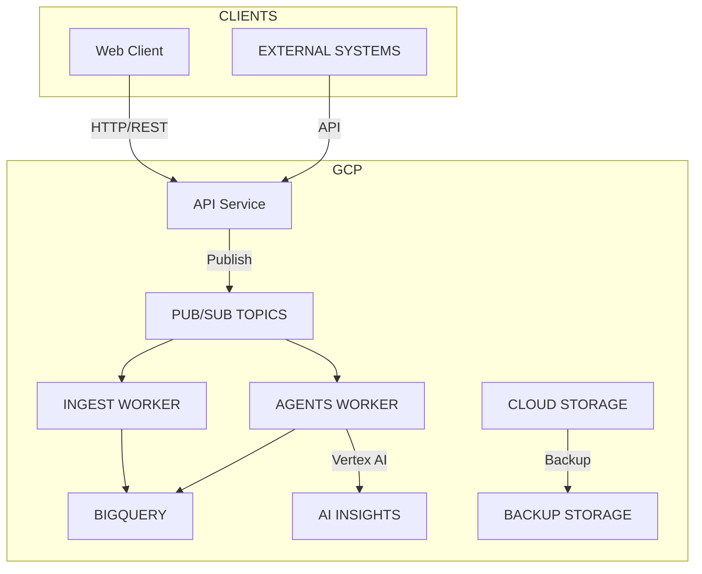

# Dulce de Saigon Architecture

## Overview

Dulce de Saigon is a data-driven platform for the Vietnamese F&B market built on Google Cloud Platform. The architecture follows a microservices pattern with event-driven communication between components.

## System Components

### 1. Web Application (apps/web)

The customer-facing web application built with Next.js that provides:

- Menu browsing and online ordering
- Customer account management
- Real-time order tracking
- Loyalty program integration
- Vietnamese language support

### 2. API Service (apps/api)

The backend API service built with Fastify that handles:

- RESTful API endpoints for web and mobile clients
- Authentication and authorization
- Business logic processing
- Event publishing to Pub/Sub
- Integration with external systems

### 3. Agents Service (apps/agents)

The AI-powered business intelligence service that:

- Processes complex tasks using Vertex AI
- Runs scheduled analytics jobs
- Generates business insights and recommendations
- Automates marketing campaigns
- Handles inventory optimization

### 4. GCP Library (libs/gcp)

A shared library providing:

- Google Cloud service integrations
- Pub/Sub message handling
- BigQuery data access
- Cloud Storage operations
- Secret Manager access

### 5. Agents Library (libs/agents)

A shared library providing:

- Agent framework and tools
- Business intelligence functions
- Task execution patterns
- Tool composition utilities

## Data Flow Architecture



## Infrastructure Components

### Google Cloud Services

1. **Cloud Run** - Containerized services for API and Agents
2. **Pub/Sub** - Event streaming and messaging
3. **BigQuery** - Data warehouse for analytics
4. **Cloud Storage** - File storage and backups
5. **Secret Manager** - Secure credential storage
6. **Cloud Logging** - Centralized logging
7. **Cloud Monitoring** - Performance metrics and alerts
8. **Vertex AI** - Machine learning and AI capabilities

### Data Schema

#### Events Table
```sql
CREATE TABLE `dulce.events` (
  id STRING REQUIRED,
  type STRING REQUIRED,
  ts TIMESTAMP REQUIRED,
  payload JSON
);
```

#### Agent Runs Table
```sql
CREATE TABLE `dulce.agent_runs` (
  id STRING REQUIRED,
  ts TIMESTAMP REQUIRED,
  task STRING,
  tools_used STRING REPEATED,
  result STRING,
  raw JSON
);
```

## Security Architecture

### Authentication

- **Workload Identity Federation** for CI/CD authentication
- **Service Account Isolation** for each component
- **OAuth 2.0** for user authentication
- **API Keys** for system-to-system integration

### Authorization

- **Role-Based Access Control** for GCP resources
- **IAM Policies** for service accounts
- **Application-Level Permissions** for API endpoints

### Data Protection

- **Encryption at Rest** using Google-managed keys
- **Encryption in Transit** using HTTPS/TLS
- **Data Masking** for sensitive information
- **Audit Logging** for all data access

## Scalability & Reliability

### Horizontal Scaling

- **Cloud Run** automatically scales based on request volume
- **Pub/Sub** handles message buffering during traffic spikes
- **BigQuery** provides serverless analytics at scale

### Fault Tolerance

- **Multi-zone deployments** for high availability
- **Automatic failover** for critical services
- **Retry mechanisms** for transient failures
- **Circuit breakers** for external dependencies

## Vietnamese Market Adaptation

### Localization Features

- **Vietnamese Language Support** throughout the platform
- **VND Currency Integration** for pricing and transactions
- **Cultural Adaptation** in menu planning and marketing
- **Regional Compliance** with Vietnamese business regulations

### Data Residency

- **Vietnam Region Deployment** (asia-southeast1)
- **Local Data Storage** for customer information
- **Compliance with Vietnamese Data Privacy Laws**