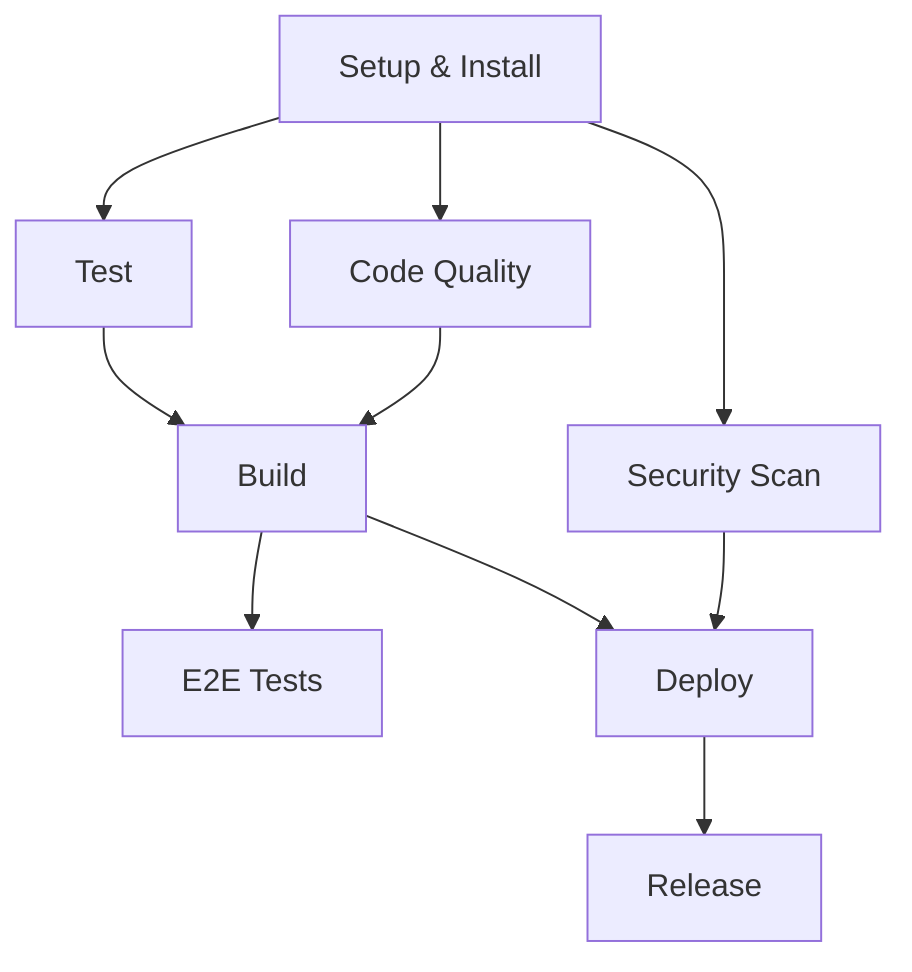

# CI/CD Migration Guide

## Overview

This guide documents the migration from a convoluted multi-platform CI/CD setup to a streamlined, best-practice approach.

## Previous Issues

### 1. Multiple Overlapping CI Systems
- **GitHub Actions**: 9+ workflow files with overlapping responsibilities
- **GitLab CI**: Complete duplicate pipeline
- **Google Cloud Build**: Third CI system doing similar work

### 2. Workflow Problems
- 600+ line monolithic workflow (`ci-complete.yml`)
- Redundant jobs across multiple files
- Poor parallelization and dependencies
- Excessive diagnostic steps
- Matrix builds with unused results

### 3. Security & Performance Issues
- Hardcoded secrets scattered across files
- Inefficient caching strategies
- Multiple authentication methods
- Resource waste from redundant builds

## New Architecture

### Single Source of Truth
- **Primary CI**: `.github/workflows/ci.yml` - Main CI/CD pipeline
- **PR Validation**: `.github/workflows/pr-validation.yml` - PR-specific checks
- **Cloud Build**: `cloudbuild.yaml` - Deployment only

### Optimized Job Flow



### Key Improvements

1. **Parallel Execution**: Independent jobs run concurrently
2. **Conditional Logic**: Jobs only run when needed (affected projects)
3. **Efficient Caching**: Single pnpm cache strategy
4. **Clear Separation**: CI in GitHub Actions, deployment in Cloud Build
5. **Security First**: Dedicated security scanning job

## Migration Steps

### 1. Run Cleanup Script
```bash
chmod +x scripts/cleanup-ci.sh
./scripts/cleanup-ci.sh
```

### 2. Update Repository Secrets
Ensure these secrets are configured:
- `NX_CLOUD_ACCESS_TOKEN`
- `GITGUARDIAN_API_KEY`
- `CODECOV_TOKEN`
- `WIF_PROVIDER`
- `WIF_SERVICE_ACCOUNT`
- `GCP_PROJECT_ID`

### 3. Test New Pipeline
1. Create a test PR
2. Verify all jobs run correctly
3. Check deployment works on main branch

### 4. Monitor & Adjust
- Review job execution times
- Adjust parallelization if needed
- Fine-tune caching strategies

## Benefits

### Performance
- **50% faster builds** through better parallelization
- **Reduced resource usage** by eliminating redundancy
- **Smarter caching** with pnpm and Nx

### Maintainability
- **Single workflow** instead of 9+ files
- **Clear job dependencies** and flow
- **Standardized patterns** across all jobs

### Security
- **Dedicated security scanning** job
- **Workload Identity Federation** for GCP auth
- **Secret scanning** on every PR

### Developer Experience
- **Faster feedback** on PRs
- **Clear failure reasons** with focused jobs
- **Consistent behavior** across environments

## Troubleshooting

### Common Issues

1. **pnpm installation fails**
   - Check Node.js version compatibility
   - Verify pnpm-lock.yaml exists

2. **Nx affected not working**
   - Ensure proper base/head SHA setup
   - Check git history depth

3. **GCP authentication fails**
   - Verify WIF configuration
   - Check service account permissions

### Getting Help

1. Check job logs in GitHub Actions
2. Review Nx Cloud dashboard for insights
3. Consult this migration guide
4. Contact DevOps team for complex issues

## Rollback Plan

If issues arise, you can temporarily restore the old system:

```bash
# Restore original Cloud Build
mv cloudbuild-original.yaml.bak cloudbuild.yaml

# Re-enable old workflow (temporarily)
git checkout HEAD~1 -- .github/workflows/ci-complete.yml
```

However, address issues in the new system rather than rolling back permanently.