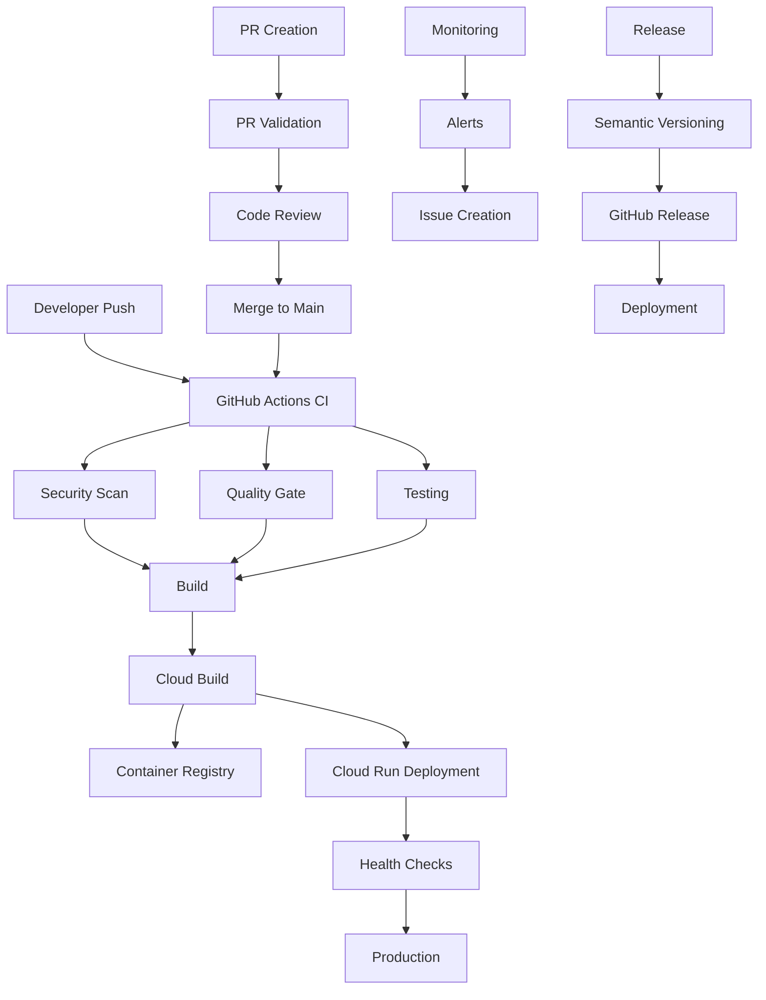

# Modern CI/CD Pipeline Documentation

## Overview

This document describes the comprehensive CI/CD pipeline for the Dulce de Saigon platform. The pipeline is designed with modern DevOps practices, security-first approach, and full automation from code commit to production deployment.

## Architecture



## Pipeline Components

### 1. Continuous Integration (CI)

**File**: `.github/workflows/ci.yml`

#### Triggers

- Push to `main`, `develop` branches
- Pull requests to `main`, `develop` branches

#### Jobs

1. **Setup & Dependencies**
   - Node.js and pnpm setup
   - Dependency installation with caching
   - Nx affected project detection

2. **Security Scanning**
   - Secret scanning with secretlint
   - Dependency vulnerability audit
   - GitGuardian scanning
   - CodeQL analysis for security vulnerabilities

3. **Code Quality**
   - Format checking with Prettier
   - Linting with ESLint
   - Type checking with TypeScript
   - Code complexity analysis

4. **Testing**
   - Unit tests with Jest
   - Coverage reporting to Codecov and Codacy
   - Parallel test execution

5. **Build**
   - Build affected projects
   - Artifact generation and upload
   - Build optimization

6. **E2E Testing** (PR only)
   - Playwright tests across multiple browsers
   - Visual regression testing

7. **Deployment** (main branch only)
   - Google Cloud authentication via WIF
   - Cloud Build deployment
   - Health checks

8. **Release Management**
   - Semantic release automation
   - GitHub release creation

### 2. Pull Request Validation

**File**: `.github/workflows/pr-validation.yml`

#### Features

- **Metadata Validation**: PR title, description, size checks
- **Security Scanning**: Comprehensive security analysis
- **Quality Gates**: Code quality enforcement
- **Performance Analysis**: Bundle size and performance checks
- **Accessibility Testing**: WCAG compliance validation
- **Status Reporting**: Automated PR status updates

### 3. Multi-Environment Deployment

**File**: `.github/workflows/deploy.yml`

#### Environments

- **Staging**: `develop` branch → staging environment
- **Production**: `main` branch → production environment
- **Manual**: Workflow dispatch for any environment

#### Features

- **Environment Detection**: Automatic environment selection
- **Pre-deployment Validation**: Security and smoke tests
- **Blue-Green Deployment**: Zero-downtime deployments
- **Rollback Capability**: Automatic rollback on failure
- **Health Validation**: Post-deployment health checks

### 4. Infrastructure Monitoring

**File**: `.github/workflows/monitoring.yml`

#### Schedule

- **Health Checks**: Every 15 minutes
- **Comprehensive Monitoring**: Daily at 6 AM UTC

#### Monitoring Areas

- **Service Health**: Cloud Run and Cloud Functions status
- **Performance**: Response times and success rates
- **Security**: Vulnerability and secret scanning
- **Infrastructure**: Resource utilization and configuration

### 5. Release Management

**File**: `.github/workflows/release.yml`

#### Features

- **Semantic Versioning**: Automatic version calculation
- **Changelog Generation**: Automated release notes
- **Breaking Change Detection**: API compatibility analysis
- **Multi-stage Validation**: Comprehensive pre-release testing
- **Production Validation**: Post-release health checks

## Security Features

### 1. Workload Identity Federation (WIF)

- **No Service Account Keys**: Secure authentication without stored credentials
- **Short-lived Tokens**: 1-hour token expiration
- **Repository-specific Access**: Limited to specific GitHub repository
- **Minimal Permissions**: Least privilege principle

### 2. Multi-layer Security Scanning

- **Secret Detection**: Multiple tools (secretlint, GitGuardian, Gitleaks)
- **Dependency Scanning**: npm audit and vulnerability databases
- **Container Scanning**: Trivy for container vulnerabilities
- **Code Analysis**: CodeQL for security vulnerabilities

### 3. Security Policies

- **Branch Protection**: Required reviews and status checks
- **Signed Commits**: Verification of commit authenticity
- **Dependency Updates**: Automated security updates
- **Access Controls**: Role-based permissions

## Quality Assurance

### 1. Code Quality Gates

- **Formatting**: Prettier enforcement
- **Linting**: ESLint with custom rules
- **Type Safety**: TypeScript strict mode
- **Test Coverage**: Minimum coverage thresholds
- **Performance**: Bundle size limits

### 2. Testing Strategy

- **Unit Tests**: Jest with coverage reporting
- **Integration Tests**: API and service testing
- **E2E Tests**: Playwright cross-browser testing
- **Smoke Tests**: Production health validation
- **Performance Tests**: Load and response time testing

### 3. Review Process

- **Automated Checks**: All quality gates must pass
- **Code Review**: Required human review
- **Security Review**: Automated security analysis
- **Documentation**: Required for significant changes

## Deployment Strategy

### 1. Environment Progression

```
Feature Branch → PR → Staging → Production
```

### 2. Deployment Methods

- **Staging**: Direct deployment on merge to develop
- **Production**: Blue-green deployment with traffic shifting
- **Rollback**: Automatic rollback on health check failure

### 3. Infrastructure as Code

- **Terraform**: Infrastructure provisioning
- **Cloud Build**: Container building and deployment
- **Nx**: Monorepo build orchestration

## Monitoring & Alerting

### 1. Health Monitoring

- **Service Availability**: 99.9% uptime target
- **Response Time**: < 2 seconds average
- **Error Rate**: < 1% error threshold
- **Resource Utilization**: CPU, memory, network monitoring

### 2. Alert Channels

- **GitHub Issues**: Automated issue creation
  -- **Notifications**: Real-time team alerts (configured externally)
- **Email Alerts**: Critical issue notifications

### 3. Incident Response

- **Automated Detection**: Proactive issue identification
- **Escalation Procedures**: Defined response protocols
- **Runbooks**: Documented troubleshooting guides
- **Post-mortem Process**: Learning from incidents

## Configuration

### 1. Required Secrets

#### GitHub Repository Secrets

```bash
# Google Cloud Authentication
GCP_PROJECT_ID=saigon-signals
WIF_PROVIDER=projects/123456789/locations/global/workloadIdentityPools/github/providers/github
WIF_SERVICE_ACCOUNT=github-actions@saigon-signals.iam.gserviceaccount.com

# External Services
CODECOV_TOKEN=your-codecov-token
CODACY_PROJECT_TOKEN=your-codacy-token
GITGUARDIAN_API_KEY=your-gitguardian-key
# SLACK_WEBHOOK example removed

# Optional
NX_CLOUD_ACCESS_TOKEN=your-nx-cloud-token
```

#### Environment Variables

```bash
NODE_VERSION=20
PNPM_VERSION=9
```

### 2. Branch Protection Rules

#### Main Branch

- Require pull request reviews (2 reviewers)
- Require status checks to pass
- Require branches to be up to date
- Require signed commits
- Restrict pushes to administrators only

#### Develop Branch

- Require pull request reviews (1 reviewer)
- Require status checks to pass
- Allow force pushes for administrators

### 3. Nx Configuration

#### Affected Detection

```json
{
  "defaultBase": "main",
  "nxCloudId": "your-nx-cloud-id"
}
```

#### Cacheable Operations

- `build`
- `test`
- `lint`
- `type-check`

## Performance Optimization

### 1. Build Optimization

- **Parallel Execution**: Nx parallel task execution
- **Incremental Builds**: Only build affected projects
- **Caching**: Aggressive caching strategy
- **Artifact Reuse**: Build artifact sharing

### 2. Deployment Optimization

- **Container Optimization**: Multi-stage Docker builds
- **Image Caching**: Layer caching in Cloud Build
- **Resource Allocation**: Environment-specific resource limits
- **Traffic Management**: Gradual rollout strategy

### 3. Monitoring Optimization

- **Efficient Queries**: Optimized monitoring queries
- **Alert Deduplication**: Prevent alert spam
- **Metric Aggregation**: Efficient data collection

## Troubleshooting

### 1. Common Issues

#### Build Failures

```bash
# Check affected projects
pnpm nx show projects --affected

# Clear Nx cache
pnpm nx reset

# Rebuild dependencies
rm -rf node_modules pnpm-lock.yaml
pnpm install
```

#### Authentication Issues

```bash
# Verify WIF configuration
gcloud iam workload-identity-pools describe github --location=global

# Check service account bindings
gcloud iam service-accounts get-iam-policy github-actions@saigon-signals.iam.gserviceaccount.com
```

#### Deployment Issues

```bash
# Check Cloud Run service status
gcloud run services describe dulce-api --region=asia-southeast1

# View deployment logs
gcloud builds log [BUILD_ID]
```

### 2. Debug Commands

#### Local Development

```bash
# Run affected tests
pnpm nx affected -t test

# Build affected projects
pnpm nx affected -t build

# Lint affected projects
pnpm nx affected -t lint
```

#### Production Debugging

```bash
# Check service health
curl https://dulce-api-dot-saigon-signals.asia-southeast1.run.app/health

# View service logs
gcloud logs read "resource.type=cloud_run_revision AND resource.labels.service_name=dulce-api" --limit=50
```

## Best Practices

### 1. Development Workflow

1. Create feature branch from `develop`
2. Make changes with conventional commits
3. Run local tests and linting
4. Create pull request
5. Address review feedback
6. Merge after approval

### 2. Commit Messages

```
feat: add user authentication
fix: resolve memory leak in agent runner
docs: update API documentation
test: add integration tests for billing
chore: update dependencies
```

### 3. Security Practices

- Never commit secrets or credentials
- Use environment variables for configuration
- Regularly update dependencies
- Follow principle of least privilege
- Enable all security scanning tools

### 4. Performance Practices

- Optimize bundle sizes
- Use efficient algorithms
- Implement proper caching
- Monitor resource usage
- Profile critical paths

## Metrics & KPIs

### 1. Development Metrics

- **Lead Time**: Time from commit to production
- **Deployment Frequency**: Deployments per day/week
- **Change Failure Rate**: Percentage of failed deployments
- **Mean Time to Recovery**: Time to fix production issues

### 2. Quality Metrics

- **Test Coverage**: Minimum 80% coverage
- **Code Quality Score**: Codacy grade A or B
- **Security Vulnerabilities**: Zero high/critical vulnerabilities
- **Performance Budget**: Bundle size limits

### 3. Operational Metrics

- **Uptime**: 99.9% availability target
- **Response Time**: < 2 seconds average
- **Error Rate**: < 1% error threshold
- **Resource Utilization**: Optimal resource usage

## Future Enhancements

### 1. Planned Features

- **Canary Deployments**: Gradual feature rollouts
- **Feature Flags**: Runtime feature toggling
- **Advanced Monitoring**: APM and distributed tracing
- **Chaos Engineering**: Resilience testing

### 2. Tool Integrations

- **SonarQube**: Advanced code quality analysis
- **Snyk**: Enhanced security scanning
- **Datadog**: Comprehensive monitoring
- **PagerDuty**: Incident management

### 3. Process Improvements

- **Automated Dependency Updates**: Renovate bot integration
- **Performance Budgets**: Automated performance regression detection
- **Security Policies**: OPA policy enforcement
- **Compliance Automation**: SOC2/ISO27001 compliance checks

## Support & Resources

### 1. Documentation

- [GitHub Actions Documentation](https://docs.github.com/en/actions)
- [Google Cloud Build Documentation](https://cloud.google.com/build/docs)
- [Nx Documentation](https://nx.dev/getting-started/intro)

### 2. Team Contacts

- **DevOps Team**: devops@dulcedesaigon.com
- **Security Team**: security@dulcedesaigon.com
- **Platform Team**: platform@dulcedesaigon.com

### 3. Emergency Procedures

- **Production Issues**: Create GitHub issue with `critical-priority` label
- **Security Incidents**: Contact security team immediately
- **Infrastructure Issues**: Check monitoring dashboard first

---

_This documentation is maintained by the Platform Engineering team and updated regularly to reflect the current state of the CI/CD pipeline._
