# Dulce de Saigon Architecture Diagrams

## System Architecture

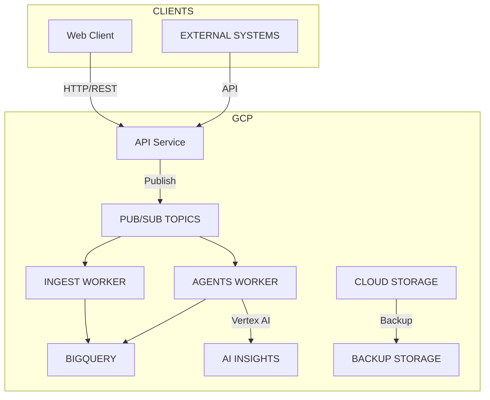

## Data Flow Diagram

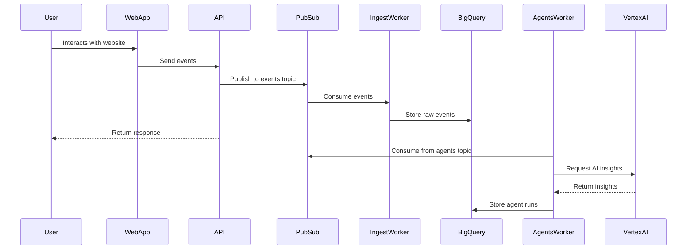

## Infrastructure Diagram

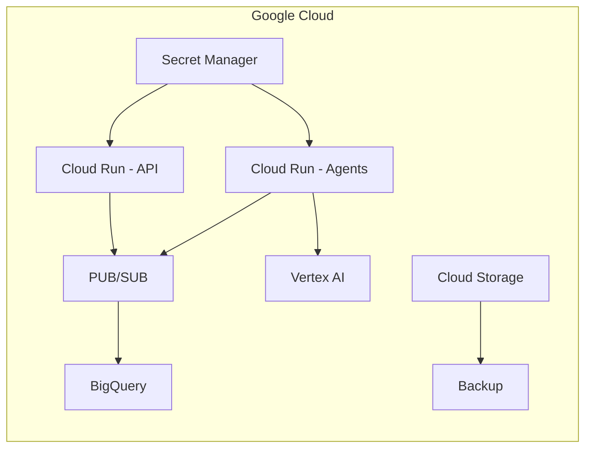

## Component Interaction Diagram

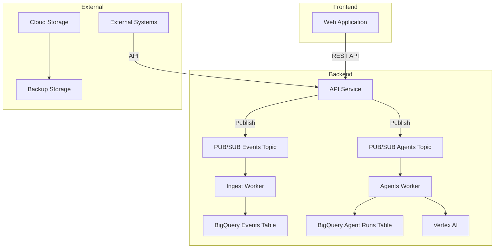

## Authentication Flow

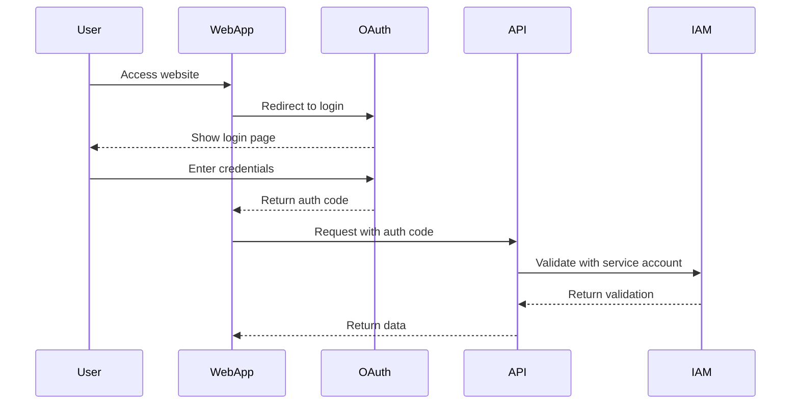

## CI/CD Pipeline

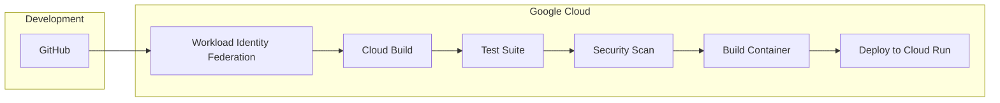

## Data Schema Diagram

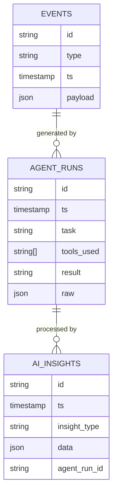

## Network Architecture

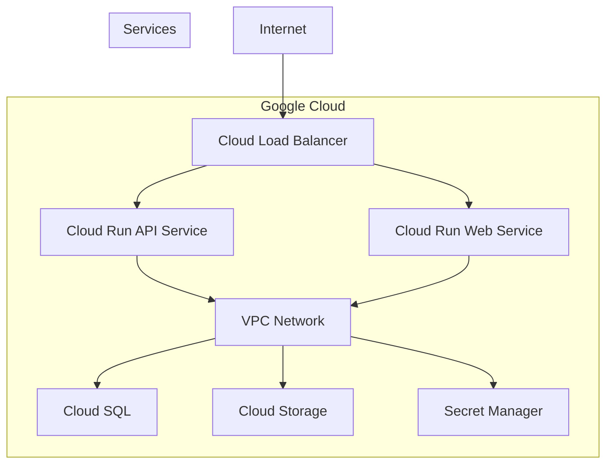

## Monitoring and Logging

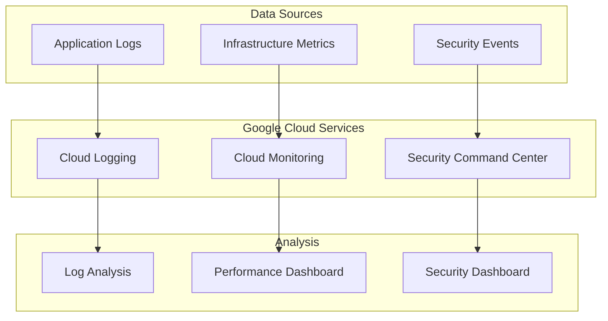

## Backup and Disaster Recovery

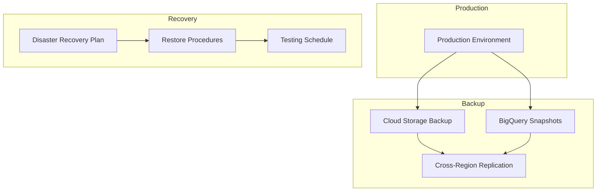

## Vietnamese Localization Flow

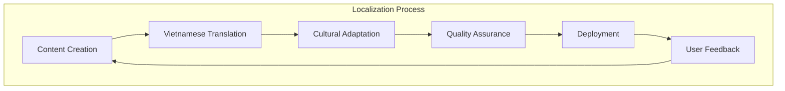

## Payment Processing Flow

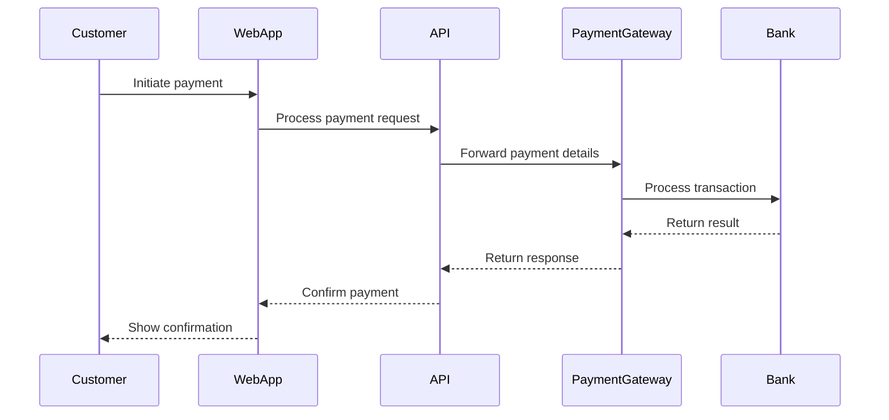

## Conclusion

These diagrams provide a visual representation of the Dulce de Saigon platform architecture, data flows, and infrastructure. They help illustrate how different components interact with each other and how data moves through the system. The diagrams are designed to be easily understandable by both technical and non-technical stakeholders.